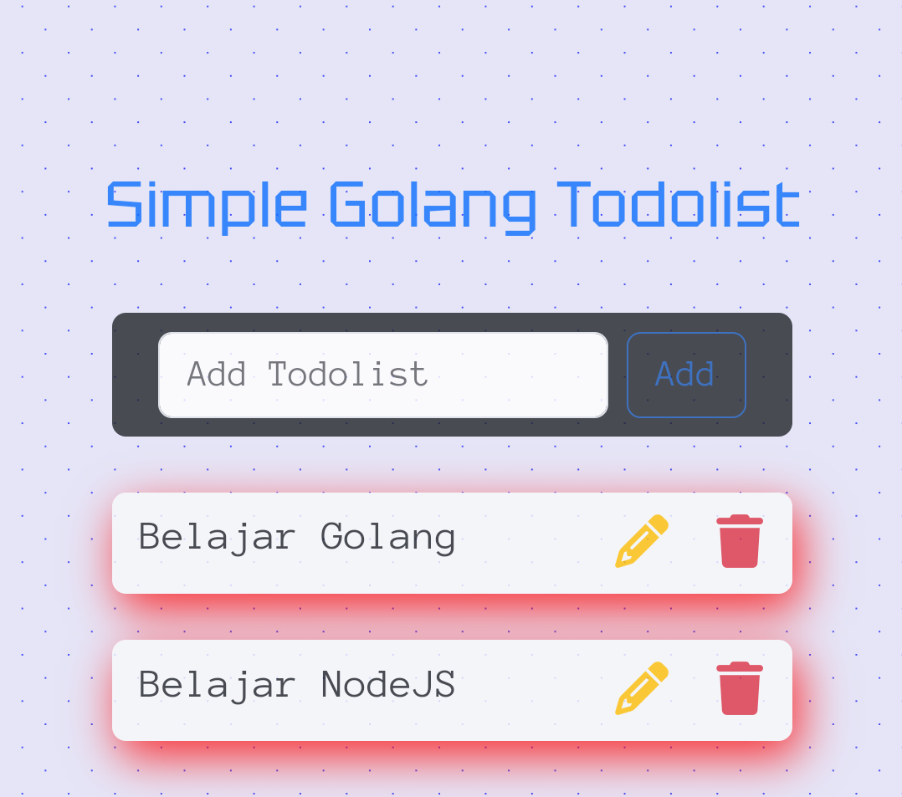

# gofiber-simple-todolist

> Studi kasus todolist menggunakan framework gofiber

## Instalation

```
git clone https://github.com/FeiraVed/gofiber-todolist
cd gofiber-todolist
go get
```

- ### Gofiber

```
go get github.com/gofiber/fiber/v2
```

- ### MySQL Driver

```
go get -u github.com/go-sql-driver/mysql
```

- ### Validator

```
go get github.com/go-playground/validator/v10
```

- ### Wire
  Tambahkan `$GOPATH/bin` ke `$PATH` di environment variable

```
go install github.com/google/wire/cmd/wire@latest
go get github.com/google/wire/cmd/wire
```

- ### Migrate

Tambahkan `$GOPATH/bin` ke `$PATH` di environment variable

```
export PATH=$PATH:$GOPATH/bin
```

```
go install -tags 'mysql' github.com/golang-migrate/migrate/v4/cmd/migrate@$TAG
```

## Setup database (MySQL)

```sql
CREATE DATABASE gofiber_todolist;
```

## Jalankan Migrate

migrate -database "mysql://user@tcp(host:port)/gofiber_todolist" -path ./app/migrate up

```
migrate -database "mysql://root@tcp(127.0.0.1:3306)/gofiber_todolist" -path ./app/migrate up
```

## Jalankan Gofiber

```
go run .
```
